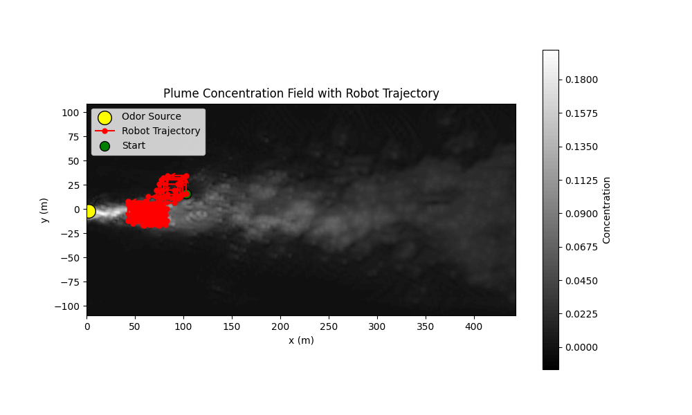
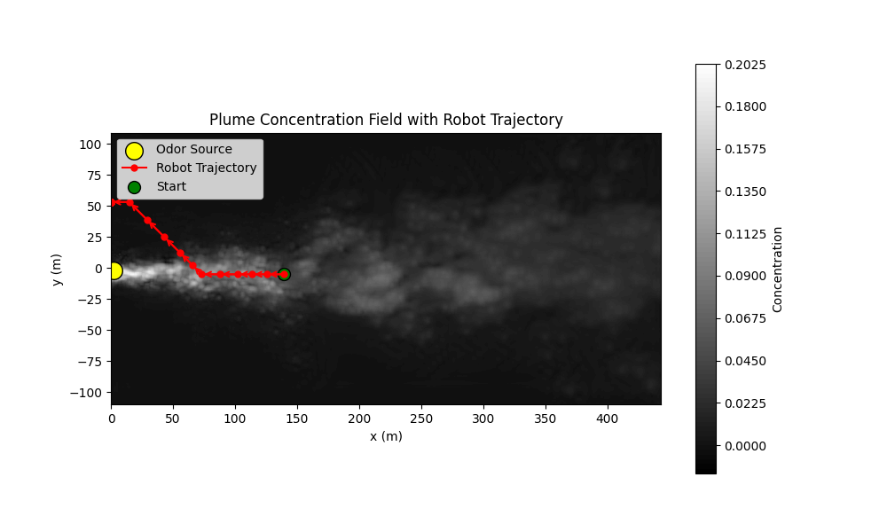

### CycleGAN
* DQN verificatio
  * [ ] Updated in 09-20: Summarize your current result. 
      * Collect robot trajectory files, images, and the table 
      * Save them into a folder
      * 09-20: Saved in a folder (trajectory images and the search time, travel distance and success rate)
  * [ ] DDPG Application
      * Make sure your DDPG code is correct
      * 09-24 update: I run the code and the result of reward plot and trajectory after training for 100 episodes:
      
      
      * [ ] Check your robot action command is correct
        * Give a fixed action command and see robot trajectory
        * For instance, if t=0 s -> DDPG output is 0 degree; if t=20 s -> DDPG output is 45 degree; if t=40 s -> DDPG output is -45 degree.
        * 09-24 update: Result of these force action. going in the opposite direction. I put t=0, t=5, and t=10 s.
          
        * Give me the feedback before Tuesday (Sep. 24th)
        * 09-23 update: I was trying to generate the robot tyrajectory and also checking the DDPG code.
        * 09-24: Worked on DDPG code only, made some corrections. But still there is issue with the step function as we can see from the force actions trajectory. it is going opposite.
        * 09-25 update: (Give run ddpg with 5000 episode with sim-to-real-generated data)
          

### Transformer-based Time-series prediction
* [ ] Develop a transformer model to predict a time-series data. 
  * [ ] Check this [paper](./../../../Reference/Polymer%20paper.pdf)
  * Training data is located [here](./../../../../Khan/Polymer_Data/Transformer-based/).
  * Develop a Transformer-based model to predict strain based on temperature and stress. 

### Graphic Neural Network-based Polymer Prediction
* The dataset is located at [here](./../../../Polymer_Data/Graphic%20Neural%20Network-based/)
* Inside this folder, you will find the following items:
  * Data
    * autoDGEBA271-IPD
      * autoDGEBA271-IPD - 1
        * **Use time, T, Lx to predict Moving Averaged Stress**
      * autoDGEBA271-IPD - 2
        * **Use time, T, Lx to predict Moving Averaged Stress**
      * ...
    * autoDGEBA326-IPD
    * ...
  * SMILES for all SMPs
    * This is the graphic feature of all polymers
  * SMPs visualized
    * This is the sample code to visualize the polymer structures
* **Task**
  * Start with how to convert a polymer structure into GNN input. 

