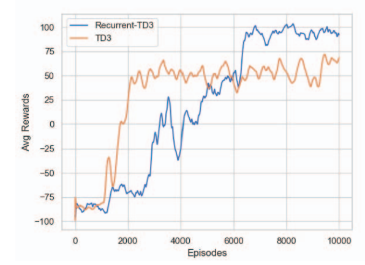
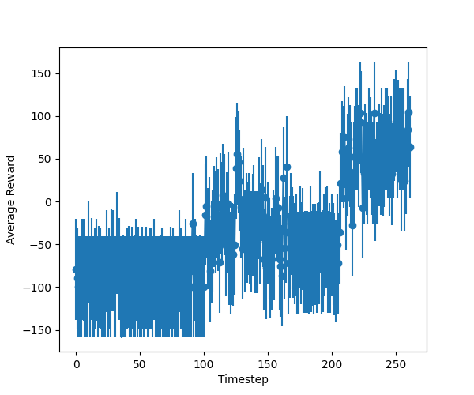
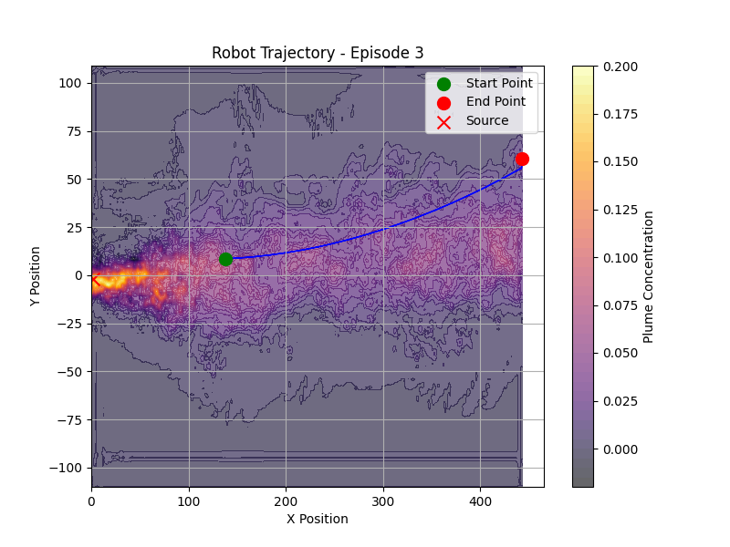

### CycleGAN -> Paper
* [ ] DDPG Application (middle priority)
  * Understand the theory behind DDPG, not just try the existing code. https://spinningup.openai.com/en/latest/algorithms/ddpg.html
  * [ ] Train the new code
    * Attach averaged reward plot here.
    * **10-01 LX Update**: This is not averaged reward. Your code to calculate average reward is wrong. 
      * The average reward plot should be smooth, not like your plot zigzag. 
      * Check my average plot. Do you see the difference? 
  
  

  
  

  

  
  

    

  

  
  

  * 09-30 update: Run the code but the results are not that we expected. SO I am trying to redefine the rewards and the action to scale down to [-0.5, 0.5], and the heading change is defined as scaled action x 45, so that the agent change its heading slowly.
  * **10-01 LX update**: from this trajectory, the robot heading is not changing. This means your code is wrong. 
    * When you see a trajectory like this, you should investigate what is the DDPG output. From the diagram, it seems like the DDPG output does not change. You should think about why it does not change. Is the evaluate code wrong? Is the DDPG always output large value so after clip the output is always 1? Is my code in updating robot position wrong? Those are questions you should ask yourself to debug your program. 
        
### CycleGAN Conference Paper (low priority): 
  * [ ] Write a conference paper (6 pages) for CycleGAN. Use DQN to prove that CycleGAN is working. Submit it to IEEE Southeast Con 2025 https://ieeesoutheastcon.org/. 

### Transformer-based Time-series prediction (High Priority)
* [ ] Develop a transformer model to predict a time-series data. 
  * Check this [paper](./../../../Reference/Polymer%20paper.pdf)
  * Training data is located [here](./../../../../Khan/Polymer_Data/Transformer-based/).
  * Develop a Transformer-based model to predict strain based on temperature and stress. 
    * [ ] Start with Feedforward Neural Network. Develop a FNN to predict strain based on temperature and stress.
    * [ ] Change FNN into Transformer. 

### Graphic Neural Network-based Polymer Prediction (High Priority)
* The dataset is located at [here](./../../../Polymer_Data/Graphic%20Neural%20Network-based/)
* Inside this folder, you will find the following items:
  * Data
    * autoDGEBA271-IPD
      * autoDGEBA271-IPD - 1
        * **Use time, T, Lx to predict Moving Averaged Stress**
      * autoDGEBA271-IPD - 2
        * **Use time, T, Lx to predict Moving Averaged Stress**
      * ...
    * autoDGEBA326-IPD
    * ...
  * SMILES for all SMPs
    * This is the graphic feature of all polymers
  * SMPs visualized
    * This is the sample code to visualize the polymer structures
* **Task**
  * [ ] Start with how to convert a polymer structure into GNN input. 
    * [ ] Find **a tutorial to learn how to train a GNN** (especially for GNN with Polymers).  

