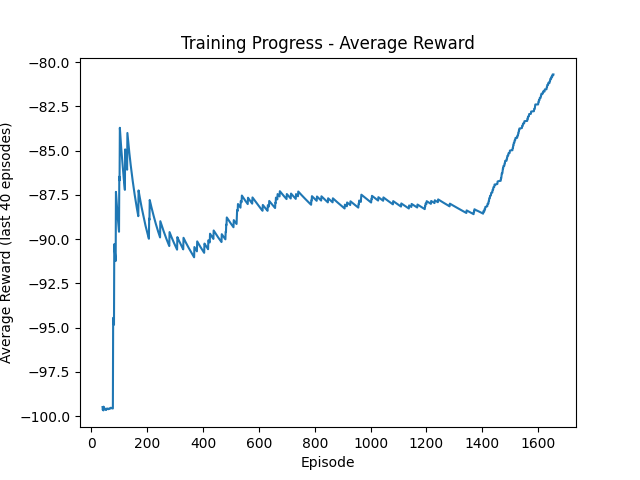
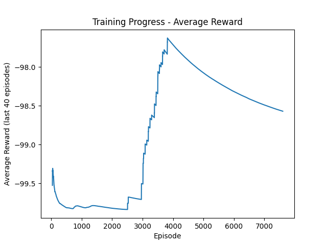
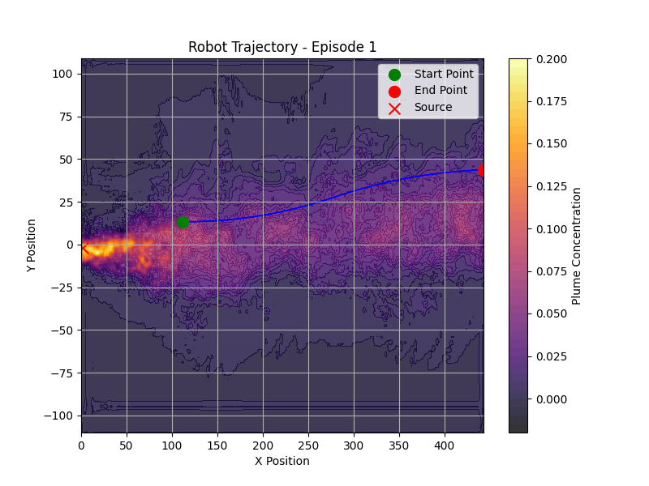

### CycleGAN -> Paper
* [ ] DDPG Application (middle priority)
  * ddpg-new: uncertain -> training code; other than this, everything else is correct. 
    * [ ] Train with 1e5 steps attach the reward plot here
  * 10-07 Update: worked on training part. need to work more.
  * ddpg-res: uncertain -> evaluation
    * [ ] Train with 1e5 steps. attach the reward plot 
    * figure out why one episode is so fast.
  * 10-07 Update: worked on incorporating plotting average reward, plotting robot trajectory, and testing part.
    * average reward plot:

    <p align="center">
    
    </p> 
  * 10-08 Update: worked on training the new code. Once trained with 1e5 steps. Then changed the step function definition on, how to robot will change it's position and trained.
    * changes in step function:
        ```
        speed_factor = max(0.1, 1 - con / self.con_max)
        self.robot_speed = 20 * speed_factor
        heading_change = self.last_action
        delta_x = np.cos(np.radians(current_heading))
        delta_y = np.sin(np.radians(current_heading))
        new_x = x + self.robot_speed * delta_x * self.t_s
        new_y = y + self.robot_speed * delta_y * self.t_s
        current_heading += (heading_change * self.t_s)

    <p align="center">
    
    
    </p> 
  * so I need to work on to debug why all the action output is -1? 

  * 10-09 Update: worked on debugging the code. Could not find anything why the action is always -1 or +1. Also, chnaged the difinition of state observation. added concentration in the state observation. Followed one paper: 
https://arxiv.org/pdf/2109.12434v2

Same result. Also, changed the robot speed to 2.5. 

  <p align="center">
    
    </p> 

  * Installed pytorch cuda version in virtual environment 

### CycleGAN Conference Paper (low priority): 
  * [ ] Write a conference paper (6 pages) for CycleGAN. Use DQN to prove that CycleGAN is working. Submit it to IEEE Southeast Con 2025 https://ieeesoutheastcon.org/. 


### Transformer-based Time-series prediction (High Priority)
* [ ] Develop a transformer model to predict a time-series data. 
  * Check this [paper](./../../../Reference/Polymer%20paper.pdf)
  * Training data is located [here](./../../../../Khan/Polymer_Data/Transformer-based/).
  * Develop a Transformer-based model to predict strain based on temperature and stress. 
    * [ ] Start with Feedforward Neural Network. Develop a FNN to predict strain based on temperature and stress.
    * [ ] Change FNN into Transformer. 


### Graphic Neural Network-based Polymer Prediction (High Priority)
* The dataset is located at [here](./../../../Polymer_Data/Graphic%20Neural%20Network-based/)
* Inside this folder, you will find the following items:
  * Data
    * autoDGEBA271-IPD
      * autoDGEBA271-IPD - 1
        * **Use time, T, Lx to predict Moving Averaged Stress**
      * autoDGEBA271-IPD - 2
        * **Use time, T, Lx to predict Moving Averaged Stress**
      * ...
    * autoDGEBA326-IPD
    * ...
  * SMILES for all SMPs
    * This is the graphic feature of all polymers
  * SMPs visualized
    * This is the sample code to visualize the polymer structures
* **Task**
  * [ ] Start with how to convert a polymer structure into GNN input. 
    * [ ] Find **a tutorial to learn how to train a GNN** (especially for GNN with Polymers).  


