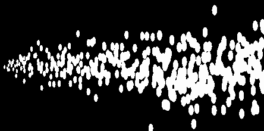
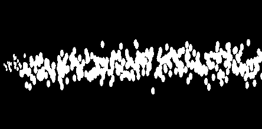
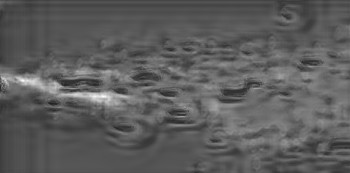
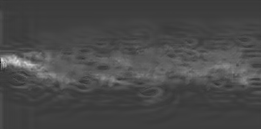
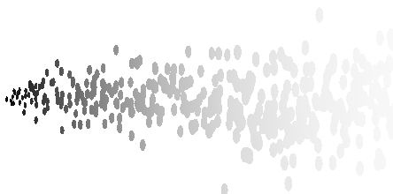
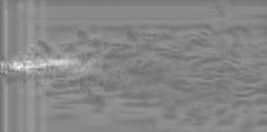

### Transformer-based Time-series prediction (High Priority)
* [ ] Develop a transformer model to predict a time-series data. 
  * Check this [paper](./../../../Reference/Polymer%20paper.pdf)
  * Training data is located [here](./../../../../Khan/Polymer_Data/Transformer-based/).
  * Develop a Transformer-based model to predict strain based on temperature and stress. 
    * [ ] Start with Feedforward Neural Network. Develop a FNN to predict strain based on temperature and stress.
    
      * 10-14 Update: Worked on data preprocessing and windowing data.
      * 10-15 Update: Worked on develop a FNN model. Trained the FNN model. Now need to check the performance of the model.
      * 10-16 update: Worked on FNN. Evaluate model performance, predict the strain. Worked on refining the FNN. Added drop out, weight decay, batch normalization. 
      Tried deeper network and different neurons on each layer.

        * RMSE: 0.1648 and MAPE: 11.14% (In the polymer paper for FCNN: RMSE : 5.16 and MAPE: 4.27%)

        

        
        

    * 10-17 Update: Worked on improving the FNN. But the performance is not improved. I tried Autoregressive LSTM model. That also gave me the 14% error. Planning to work on transformer tomorrow.
    * 10-18 Update: Started working on transformer. 
    * [ ] Change FNN into Transformer. 

* 10-11 Update: Started working on FNN to predict the time series data.

### Graphic Neural Network-based Polymer Prediction (High Priority)
* The dataset is located at [here](./../../../Polymer_Data/Graphic%20Neural%20Network-based/)
* Inside this folder, you will find the following items:
  * Data
    * autoDGEBA271-IPD
      * autoDGEBA271-IPD - 1
        * **Use time, T, Lx to predict Moving Averaged Stress**
      * autoDGEBA271-IPD - 2
        * **Use time, T, Lx to predict Moving Averaged Stress**
      * ...
    * autoDGEBA326-IPD
    * ...
  * SMILES for all SMPs
    * This is the graphic feature of all polymers
  * SMPs visualized
    * This is the sample code to visualize the polymer structures
* **Task**
  * [ ] Start with how to convert a polymer structure into GNN input. 
    * [ ] Find **a tutorial to learn how to train a GNN** (especially for GNN with Polymers).  

### CycleGAN Conference Paper (low priority): 
  * [ ] Write a conference paper (6 pages) for CycleGAN. Use DQN to prove that CycleGAN is working. Submit it to IEEE Southeast Con 2025 https://ieeesoutheastcon.org/. 

    * 10-14 Update: Completed the sim to real generation of simulated data. dimension is correct now. And the file has the necessary keys and the converted data are fine in my understanding.
    * 10-18 update:
    cycleGAN results

      * New simulated U ( record u and v where con > 0 else u and v = 0)

       

        
        
      

      * Sim to real U ( with New simulated U and cycleGAN con model )

       

        
        
      

      * New simulated V ( record u and v where con > 0 else u and v = 0)

       

        
        
      

      * Sim to real V ( with New simulated V and cycleGAN con model )

       

        
        
      

