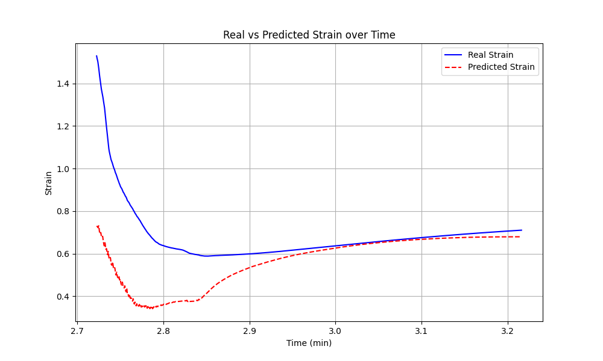
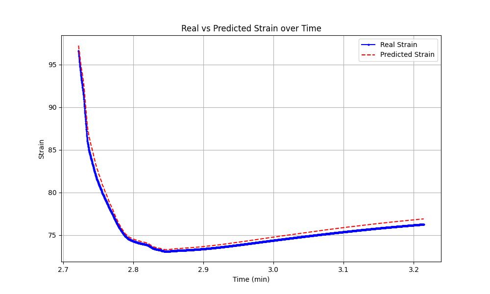
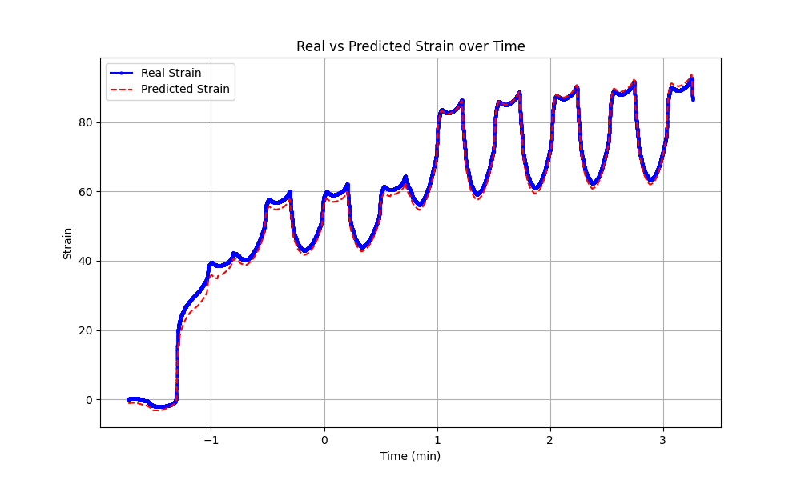
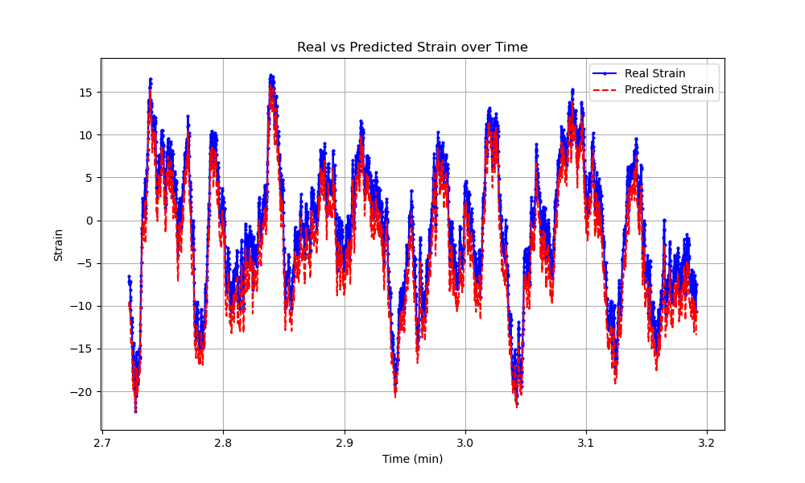
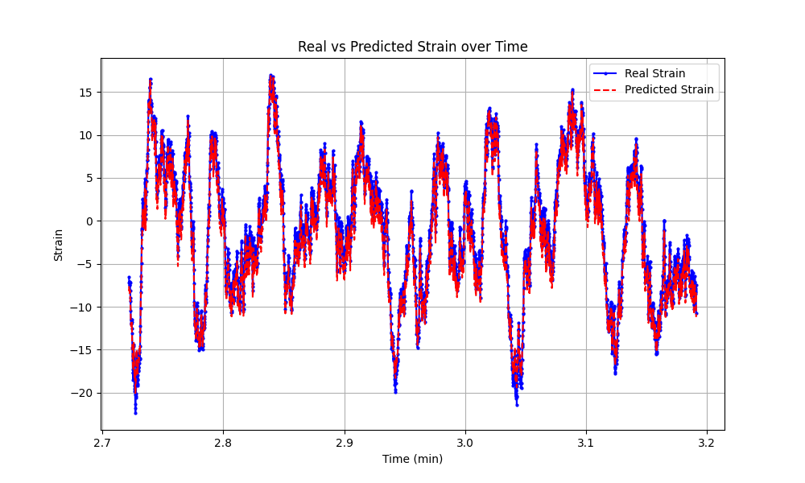

### Transformer-based Time-series prediction (High Priority)
* [x] Develop a transformer model to predict a time-series data. 
  * Check this [paper](./../../../Reference/Polymer%20paper.pdf)
  * Training data is located [here](./../../../../Khan/Polymer_Data/Transformer-based/).
  * Develop a Transformer-based model to predict strain based on temperature and stress. 
    * [x] Start with Feedforward Neural Network. Develop a FNN to predict strain based on temperature and stress.

        * RMSE: 0.1648 and MAPE: 11.14% (In the polymer paper for FCNN: RMSE : 5.16 and MAPE: 4.27%)

        

        
        

    * [x] Change FNN into Transformer.

      * Test portion of the dataset  (UV_cured_PBD-3_ca-6min: Training 70%, Validation 20%, Testing 10%):
        - Test RMSE: 0.0215, Test MAPE: 2.55%

        - prediction Plot: 
        

        
        

      * New dataset for testing (UV_cured_PBD-3_ ca-140s):
        - Test RMSE: 0.0584, Test MAPE: 140.96%

        - prediction Plot: 
        

        
        

    - [ ] **NEW (11-11-2024)**: Write a journal paper regarding the FNN, CNN, and Transformer-based time series prediction for polymer data. 
      - Journal paper link: https://www.mdpi.com/journal/information/special_issues/93P6E594J2#benefits
      - [ ] Write an Abstract, make a title, share the overleaf file with me. 
      
    * 10-20 Update: Worked on writing the abstract, title, literature review, and reporting the results that I have till now.
        
          

    * 11-15 update: worked on CNN for time series prediction. Got RMSE : 0.0817, MAPE: 11.14% 
      * [ ] Add more CNN layers (check the paper for architecture structure)
      * [ ] Need a figure of testing result on testing data
    * LSTM: I had implemented autoregressive LSTM previously and the result was : Test RMSE: 0.1438, Test MAPE: 14.13%. Now converting that into LSTM, which is on progress. 
      * [ ] Need a figure of testing result on testing data

### Graphic Neural Network-based Polymer Prediction (High Priority)
* The dataset is located at [here](./../../../Polymer_Data/Graphic%20Neural%20Network-based/)
* **Task**
  * [x] Start with how to convert a polymer structure into GNN input. 
  * [ ] Develop GNN on predicting Moving Averaged Stress

  * 11-19 Update: Worked on graph embedding and time series prediction to predict moving average stress. Results of the graph embedding time series and only time series predictions are given below:

    * prediction Plot of test portion (10%) data (USING Graph Embedding and TIME SERIES TRANSFORMER):
      - RMSE: 0.0762, MAPE: 5.57%, Pearson Correlation: 0.9984  
        

        
        

    * prediction Plot of test portion (10%) data (USING ONLY TIME SERIES TRANSFORMER):
      - RMSE: 0.0294, MAPE: 2.08%, Pearson Correlation: 0.9980  
        

        
        

### CycleGAN Conference Paper (low priority): 
  * [ ] Write a conference paper (6 pages) for CycleGAN. Use DQN to prove that CycleGAN is working. Submit it to IEEE Southeast Con 2025 https://ieeesoutheastcon.org/. 
  

