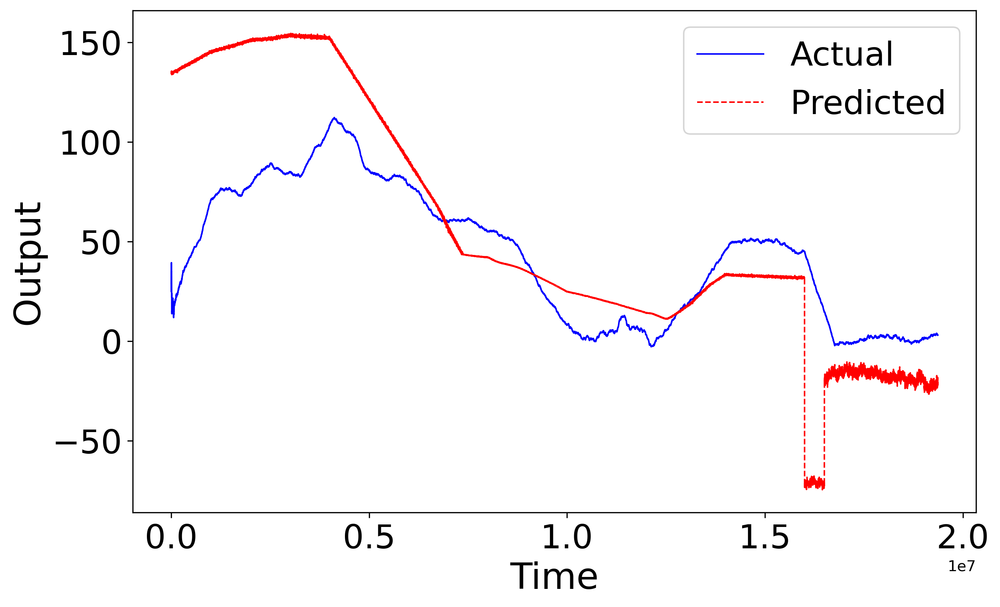

#### Graphic Neural Network-based Polymer Prediction
* Graphic Neural Network Benchmark
  * Update Figure 1 in the manuscript
    * [x] Include W1 as a part of the input to the graphic transformer
  * Organize the code and result
    * [ ] Need the code to re-generate the reported result.

* **02-07**
  * [x] Make a more smooth moving average plot (increase the window size of moving average)
  
  * [x] train a CNN on 10 csv files instead of 1 file see if the prediction result is good. 
    * Result is not good
        * After training with 10 csv files from dataset 271:
        * Test RMSE: 1.2276, MAPE: 563.89%, Pearson Corr: 0.8267

        

            
        

* **02-17**
    * GNN (simple) + RNN/CNN/FNN to see if the performance is better
    * Predict the running average
    * Dynamic Graph Representation

#### A Paper Reading Tool
* [Zotero](https://www.zotero.org/)
* How to use Zotero?
  * Tutorial 1: https://libguides.unm.edu/zotero
  * Tutorial 2: https://www.zotero.org/support/quick_start_guide