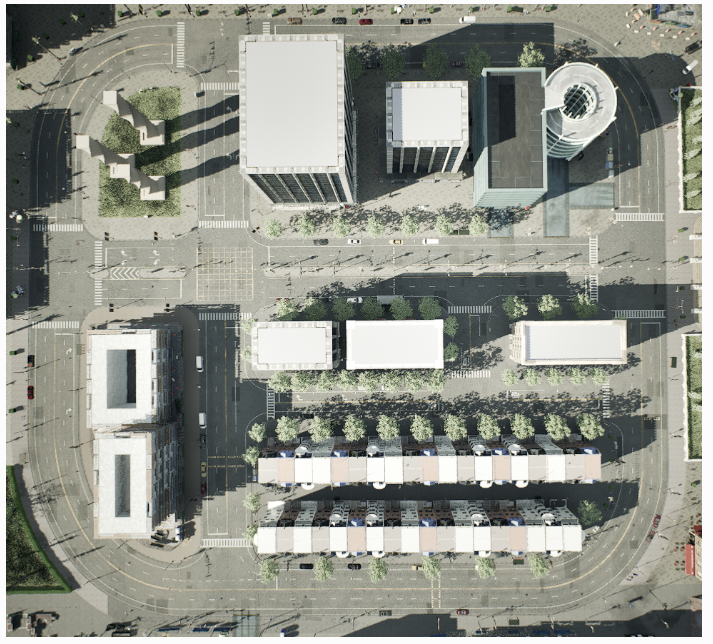

## 10-06
* Pesduo-code:
```
time = 0
while:
    vehicle_status = get_vehicle_status(time)
    environment_status = get_env_status(time)
    behavior = LLM(vehicle_status, environment_status)
    if behavior == "GO":
        GO()
    If behavior == "Follow":
        Follow()
    ...
    time = time + 1
```
* So far, you have GO(). Now we need Follow(), STOP(), LANE_CHANGE()

* Also think about how to make a global plan. 


* How the global route plan is generated? 
    * If I want the vehicle to loop on the outside loop, how to achieve this?
    * If I want the vehicle to loop inside the loop, how to achieve this?
* How to define the vehicle initial position? 
* A global map with coordination
    * Where is (0,0) in this map?
    * where is x axis/y axis? 
* Check API. check other people's work (find examples. Reinforcement learning using carla)


